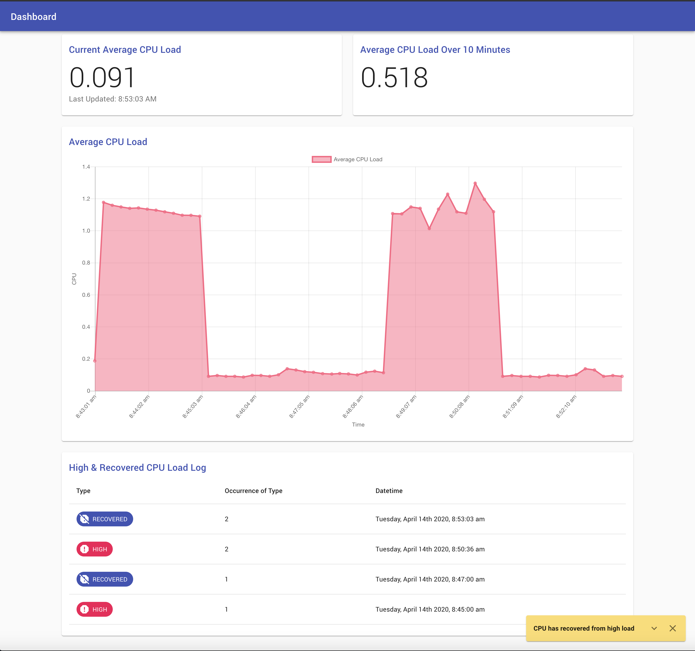

## Load Monitoring Web Application

#### [Project Instructions/Guidelines](Assignment.md)

## Instructions for Running App Locally 
### Install Packages
(I am using node 13)

1) From the root directory, run:
##### `yarn intall`

2) From the root directory, run:
##### `cd client/` then `yarn install`

### Run App
1) To start the backend, from the root directory, run:
##### `node server.js`

2) To start the frontend, from the root directory, run: 
##### `cd client/` then `yarn start`

### Run Tests
1) To run tests, from the root directory, run:
##### `cd client/` then `yarn test`

## Improvements Needed for Production
* Store data in database so it is not lost when app is restarted/refreshed.
* Add responsive/adaptive design.
* Add better handling of alerting:
  - add sound effect to play when alert occurs.
  - potentially add secondary notification (slack, email) if alert on app is not acknowledged.
